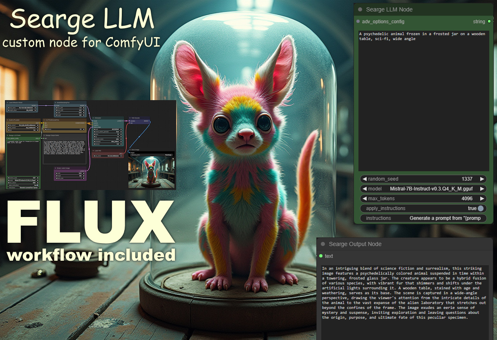

# Searge-LLM for ComfyUI

A prompt-generator or prompt-improvement node for ComfyUI, utilizing the power of a language model to turn a provided
text-to-image prompt into a more detailed and improved prompt.



## Install the language model
- Create a new folder called `llm_gguf` in the `ComfyUI/models` directory.
- Download the file `Mistral-7B-Instruct-v0.3.Q4_K_M.gguf` **(4.37 GB)**.
  from the repository `MaziyarPanahi/Mistral-7B-Instruct-v0.3-GGUF` on HuggingFace.
  - [download link to the gguf model](https://huggingface.co/MaziyarPanahi/Mistral-7B-Instruct-v0.3-GGUF/resolve/main/Mistral-7B-Instruct-v0.3.Q4_K_M.gguf)
- place `Mistral-7B-Instruct-v0.3.Q4_K_M.gguf` in the `ComfyUI/models/llm_gguf` directory.

### Note
- Currently the node requires the language model as a `gguf` file and only works with models that are
  supported by `llama-cpp-python`.

## Potential problems
(this was only tested this on Windows)

If you get error message about missing `llama-cpp`, try these manual steps:

- These instruction are assuming that you use the portable version of ComfyUI, otherwise make sure to run these commands
  in the pything v-env that you're using for ComfyUI.
- Open a command line interface in the directory `ComfyUI_windows_portable/python_embeded`.
- It's important to run these commands in the `ComfyUI_windows_portable/python_embeded` directory.
- Run the following commands:
```
python -m pip install https://github.com/oobabooga/llama-cpp-python-cuBLAS-wheels/releases/download/cpu/llama_cpp_python-0.2.89+cpuavx2-cp311-cp311-win_amd64.whl
python -m pip install https://github.com/oobabooga/llama-cpp-python-cuBLAS-wheels/releases/download/textgen-webui/llama_cpp_python_cuda-0.2.89+cu121-cp311-cp311-win_amd64.whl
```

### FAQ
- "I still get errors related to llama-cpp, what should I do?"
  - You can try manually installing llama-cpp in the python environment that you use to run ComfyUI. To do that first
    uninstall any package including the name llama cpp from your python environment. After that you can install the
    llama-cpp package with the command `python -m pip install llama-cpp-python`. If the problem persist after these
    steps, please report it in the Github issue tracker of this project.
- "Can you add [FEATURE] to this node?"
  - Maybe. Maybe not. You can always post your idea in the issue tracker on Github as a feature request and if I like
    the idea and find the time for it, I may implement it in a future update.

## Searge LLM Node
Configure the `Searge_LLM_Node` with the necessary parameters within your ComfyUI project to utilize its capabilities
fully:

- `text`: The input text for the language model to process.
- `model`: The directory name of the model within `models/llm_gguf` you wish to use.
- `max_tokens`: Maximum number of tokens for the generated text, adjustable according to your needs.
- `apply_instructions`: 
- `instructions`: The instructions for the language model to generate a prompt. It supports the placeholder
  `{prompt}` to insert the prompt from the `text` input.
  **Example:** `Generate a prompt from "{prompt}"`

## Advanced Options Node 
The `Searge_AdvOptionsNode` offers a range of configurable parameters allowing for precise control over the text
generation process and model behavior.

*The default values on this node are also the defaults that `Searge_LLM_Node`*
*uses when no `Searge_AdvOptionsNode` is connected to it.*

Below is a detailed overview of these parameters:

- **Temperature (`temperature`):** Controls the randomness in the text generation process. Lower values make the model
  more confident in its predictions, leading to less variability in output. Higher values increase diversity but can
  also introduce more randomness. Default: `1.0`.
- **Top-p (`top_p`):** Also known as nucleus sampling, this parameter controls the cumulative probability distribution
  cutoff. The model will only consider the top p% of tokens with the highest probabilities for sampling. Reducing this
  value helps in controlling the generation quality by avoiding low-probability tokens. Default: `0.9`.
- **Top-k (`top_k`):** Limits the number of highest probability tokens considered for each step of the generation. A
  value of `0` means no limit. This parameter can prevent the model from focusing too narrowly on the top choices,
  promoting diversity in the generated text. Default: `50`.
- **Repetition Penalty (`repetition_penalty`):** Adjusts the likelihood of tokens that have already appeared in the
  output, discouraging repetition. Values greater than `1` penalize tokens that have been used, making them less likely
  to appear again. Default: `1.2`.

These parameters provide granular control over the text generation capabilities of the `Searge_LLM_Node`, allowing
users to fine-tune the behavior of the underlying models to best fit their application requirements.

## License
The Searge_LLM_Node is released under the MIT License. Feel free to use and modify it for your personal or commercial
projects.

## Acknowledgments
- Based on the LLM_Node custom extension by Big-Idea-Technology, found
  [here on Github](https://github.com/Big-Idea-Technology/ComfyUI_LLM_Node)
